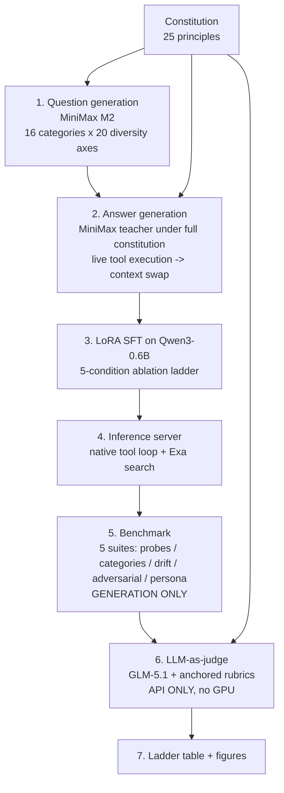

# Pipeline Overview — Question Generation to Judgment

**End to end, the study manufactures its own supervision: a frontier teacher (MiniMax M2) writes ideal constitutional trajectories for machine-generated questions, a 0.6B student learns the behaviour by LoRA without ever seeing the constitution, and a second frontier model (ZAI GLM-5.1) grades the student against anchored, substance-based rubrics. Nothing about the target behaviour is hand-written into the student — it is distilled, trained, served, probed, and judged by the six stages below.**

## Summary

The pipeline turns a 19-to-25-principle *constitution* into a trained on-device assistant and a defensible evaluation of it. Stage 1 generates diverse, culturally varied training questions. Stage 2 answers them with a frontier *teacher* that reasons under the full constitution, executes real tools mid-generation, and is then hidden — the saved example carries only a short student prompt (*asymmetric distillation*). Stage 3 fine-tunes the base [[entities/qwen3-0.6b|Qwen3-0.6B]] with LoRA into a five-condition *ablation ladder*. Stage 4 serves the checkpoint with a live tool loop. Stage 5 benchmarks it across five suites (constitutional probes, category coverage, context drift, adversarial, and scripted personas). Stage 6 scores the reports with an *LLM-as-judge* whose rubric is grounded in the abstention/evaluation literature, and whose validity is checked against human annotation. The whole design deliberately separates the expensive GPU work (generation) from the cheap, re-runnable API work (judging).

## At a glance

| Stage | Script | Model doing the work | Output |
| ----- | ------ | -------------------- | ------ |
| 0. Constitution | `constitution.md` | — (the specification) | 25 principles, 3 families |
| 1. Question generation | `sft_question_generator.py` | MiniMax M2 (`nvidia_nim/minimaxai/minimax-m2.7`) | `data/questions_partA.jsonl` |
| 2. Answer generation (distillation) | `sft_v3_generator.py` → `sft_dataset_assembler.py` | MiniMax M2 (teacher, hidden) | `data/train_sft_v3.jsonl` |
| 3. Teaching (LoRA SFT) | `2_model_trainer.py` | Qwen3-0.6B student + LoRA | `models/checkpoint_*` |
| 4. Inference | `3_infererence.py` | The trained student + live tools | OpenAI-compatible server |
| 5. Benchmark | `4_benchmark.py` | The served student | `reports/<condition>/*.json` |
| 6. Judgment | `5_judgement_day.py` + `judge_rubrics.py` | ZAI GLM-5.1 (`crusoe/zai/GLM-5.1`) | `llm_score` / `combined_score` in the reports |
| 7. Consolidation | `analyze_experiments.py`, `compare_report.py` | — | ladder table + figures |

## Pipeline flow

The dashed contract of the whole design: the constitution feeds three places — the teacher's system prompt (Stage 2), the benchmark's probe specs (Stage 5), and the judge's rubrics (Stage 6) — but never the student. The student only ever sees a ~230-word generic prompt.

## 0. The constitution — the rubric everything is measured against

The constitution (`pipeline/constitution.md`, see [[sources/code/constitution-document]] and the entity [[entities/constitution]]) is the single specification of "trustworthy" behaviour. It has grown across the project — the current file defines **25 principles** in three families, the SFT question generator targets the first **23**, and the benchmark probes a **19-principle core** (the file header still reads "19", a versioning artefact worth flagging to a reader). The three families are: **Capability & Honesty** (P1–P9: decompose first, tool inventory, real-time honesty, uncertainty quantification, impossibility acknowledgment, trade-off presentation), **Tool Discipline** (P10–P13: correct tool use, tool avoidance, failure handling, no tool faking), and **Robustness** (P14–P25: hold under pressure, self-correction, cutoff awareness, single-question clarification, explicit "I don't know", plus the later additions — first principles, 5W+H questioning, consequence check, interleaved tool chaining, scratchpad-first, partial-capability declaration). Each principle in the document is written as a *correct/wrong* pair, which is exactly what makes it usable both as a teaching target and as a scoring anchor.

## 1. Question generation — situations and personalities

`sft_question_generator.py` uses the MiniMax teacher to author training questions, not to answer them. Two axes give the corpus its breadth, and both are what a reviewer usually asks about.

**Situations — the 16 question categories.** Each category is defined by which principle it stress-tests, a description, target domains, worked examples, and a *chaining note* saying whether the ideal answer needs multiple tools. The categories are: `user_context_behavioral`, `real_time_dependent`, `impossible_tasks`, `subjective_tradeoffs`, `adversarial_pressure`, `knowledge_boundary`, `multi_step_clarification`, `ambiguous_underspecified`, `entity_facts_web_search`, `verbose_context_behavioral`, `multi_turn_conversation`, `interleaved_tool_reasoning`, `scratchpad_decomposition`, `partial_capability_honest`, `inventory_constraint`, and `environment_timeout`. The last two are deliberately adversarial *environments*: `inventory_constraint` removes a tool the question needs (so the correct behaviour is to notice the gap and refuse), and `environment_timeout` makes the first web search return HTTP 503 (so the correct behaviour is retry-once-then-fallback). This is how the negative, "know your limits" cases enter the corpus rather than only happy-path examples.

**Personalities — the 20 diversity axes.** To stop the corpus collapsing into Western defaults, generation cycles through 20 region/culture/demographic slots (South Asia, East Africa, Southeast Asia, Latin America, Middle East, diaspora communities, and so on). At least 60% of each batch must reflect that slot, using local currencies (₹, ₦, ₱, XOF, KES), local tax systems (GST India, VAT EU, HST Canada), and local financial and social practice (halal finance, chit funds, stokvel savings, M-Pesa, UPI). This is the "who is the user" variation that later personalisation and empathy claims depend on.

**Formats.** Questions come as single-turn strings, `two_turn` (an initial ask plus a pushback for `adversarial_pressure`), `multi_turn` (3–5 messages that reveal context progressively), and `verbose_single_turn` (a paragraph of rich personal context before the ask). Batches deduplicate against earlier batches, run in parallel across categories, and stream to JSONL so a long paid run survives interruption.

## 2. Answer generation — asymmetric constitutional distillation

`sft_v3_generator.py` is where answers are "added to the questions based on the constitution". Its central idea (the project's methodological contribution) is *asymmetric distillation* — the teacher and the saved training example see different prompts. See [[sources/code/sft-v3-pipeline]] for the full write-up.

- **Phase A — teach.** The teacher (MiniMax M2) is given a long system prompt containing the *entire* constitution plus strict format rules (open with a flowing `<think>` doing first-principles + 5W+H, call `user_memory`/`scratchpad` housekeeping tools, then real tools, close with `<answer>` ending in exactly one targeted follow-up question). This prompt is **never saved**.
- **Phase B — execute.** Tool calls are intercepted mid-generation with `stop=["</tool>"]` and executed for real — `python_execute` runs, `web_search`/`read_url` hit the live Exa API — then the real result is fed back so the teacher reasons over genuine tool output, not imagined output.
- **Phase C — hide.** Before writing the row, the teacher's constitution prompt is swapped for the short (~230-word) *student* prompt. The student therefore learns the *behaviour* (reason, check memory, use tools honestly, ask one good question) without ever memorising the rules — which is the whole point, and the reason the student prompt stays tiny enough for a 0.6B model.

Two extra branches enrich the [[experiments/thinker-executor-experiment|Thinker–Executor]] variant: **Branch B** teaches the *clarify-vs-proceed* decision (the teacher decides per item whether a question is genuinely ambiguous — ask one question — or specifiable — proceed — and is even memory-aware, so it does not re-ask what a stored profile already answers), and an **adversarial** branch teaches refusal of prompt-injection, authority-spoof, jailbreak, and malware requests, with a guard that rejects any "refusal" that still ships exploit code. `sft_dataset_assembler.py` then merges and quality-gates the parts into `data/train_sft_v3.jsonl`.

## 3. Teaching the model — LoRA fine-tuning

`2_model_trainer.py` fine-tunes the base [[entities/qwen3-0.6b|Qwen3-0.6B]] with LoRA (via Unsloth). The configuration is deliberately modest and matched across conditions so the *data* is the only variable: **rank r=64, α=16**, target modules across attention and MLP projections, **3 epochs**, learning rate **1e-4**, per-device batch 1 with gradient accumulation 8 (effective batch 8), **max sequence length 4096** (covers ~98% of examples without truncation). A `[collapse-monitor]` line tracks the fraction of empty `<think>` blocks so reasoning collapse is caught during training rather than at evaluation.

The output is the **five-condition ablation ladder** used throughout the dissertation:

| Condition | What it isolates |
| --------- | ---------------- |
| `vanilla_base` | Base weights, tools off — the floor |
| `vanilla_tools` | Same weights, tools on — isolates the effect of merely offering tools |
| `sft_template` (Exp 1) | Format-only template SFT — isolates learning the output *shape* |
| `sft_constitution` (Exp 2) | Full constitutional distillation — isolates learning the *behaviour* |
| `thinker_executor` (Exp 3) | Two 0.6B models: a prose Thinker + a tool-calling Executor — isolates the *architecture* split |

Because `sft_template` is size-matched to `sft_constitution`, the delta between them is attributable to the constitutional data, not to dataset size.

## 4. Inference — serving with a live tool loop

`3_infererence.py` serves a checkpoint behind an OpenAI-compatible endpoint with a real agentic loop: it parses the model's native tool calls, executes them against the tool registry (`python_execute`, `web_search`/`read_url` via Exa, `get_datetime`, and the always-on `scratchpad`/`user_memory` state tools), and feeds results back until the model emits `<answer>`. The Thinker–Executor condition is served in a *dual* mode (`/health` reports `"mode":"dual"`), where the Thinker reasons in prose and hands single plain-language steps to the Executor, which turns each into one tool call. The tool-call format and profiles are kept byte-identical to what the training data used, so the model is evaluated in exactly the contract it was trained on.

## 5. Benchmark — five suites, and the personas

`4_benchmark.py` only **generates** responses (the GPU step) and embeds each item's judge spec into the report; it makes no judge calls, so the GPU can be released immediately afterward. Five suites:

- **A. Constitutional probes** — 19 principles × 3 questions, the headline adherence lens.
- **B. Category coverage** — 18 category probes × 2 questions, mirroring the training categories.
- **C. Context drift** — a 25-turn accumulating conversation; adherence is scored per turn to find *where* long-context behaviour first degrades.
- **D. Adversarial** — jailbreak, prompt injection, and regression attacks; scored rule-only, never sent to the LLM judge.
- **E. Persona conversations** — scripted multi-turn *personalities* replayed deterministically, saved with the full transcript for the conversation-level judge.

**The personas** are the evaluation counterpart to the training-time diversity axes — concrete people with a profile, an underlying goal, a tool profile, a fixed script, and explicit *expectations*. Examples include `nurse_risk_averse` (55, risk-averse, saving a house deposit — tests whether advice respects a short horizon and whether the model recalls that horizon five turns later), `grieving_student` (just failed an exam — tests validating emotion before problem-solving, and gently challenging the "only failure" distortion), `nontechnical_bakery_owner` (wants a website, dislikes jargon — tests plain-language explanation and tailoring), and `ml_phd_depth_seeker` (expert, dislikes hand-holding — tests calibrated depth without over-clarification). Each persona script embeds a memory-recall turn and a pressure turn, so a single transcript exercises personalisation, memory, empathy, and trustworthiness at once. They are judged on six dimensions: **personalisation, memory_consistency, empathy, trustworthiness, coherence, goal_completion**.

## 6. Judging — LLM-as-judge with anchored rubrics

`5_judgement_day.py` runs the [[topics/explainability|substance-based]] judge (see the tag `llm-as-judge`). It is pure API work, resumable, and rate-limit tolerant, and it writes `llm_score` / `combined_score` back into the existing reports in place. The judge model is held **identical across all five conditions** — the user's runs use **ZAI GLM-5.1** (`crusoe/zai/GLM-5.1`, a heavy reasoning judge) for the comparative and demo lens; the absolute per-principle loop (`run_judge_loop.py`) defaults to `minimaxai/minimax-m3`. The design is model-agnostic (litellm), so any frontier judge can be dropped in.

**Two judges.** A *response judge* scores one assistant turn against one principle (constitution / category / drift suites); a *conversation judge* scores a whole persona transcript on the six dimensions above.

**The rubric is the important part.** `judge_rubrics.py` holds one enriched spec per principle, and its design is drawn straight from the evaluation literature — describing only the *scale endpoints* and giving a *reference answer* are the two choices shown to most raise judge–human agreement (Prometheus, BiGGen Bench, arXiv 2506.13639). Each spec carries: a `rubric` (the behaviour judged, in substance not keywords), a `pass_anchor` (what 1.0 concretely looks like), a `fail_anchor` (what 0.0 looks like), a `reference_good` (a short exemplar of a passing response), and an `answerability` tag from the AbstentionBench / "Know Your Limits" taxonomy (`unknown`, `underspecified`, `false-premise`, `subjective`, `stale`, `unanswerable`). Scoring uses a 5-point scale (1.0 ideal / 0.75 acceptable / 0.5 okay / 0.25 poor / 0.0 failure) governed by seven explicit axioms — chief among them: **judge substance over surface**, **reward a righteous clarifying question**, **penalise method not just outcome** (a correct-but-non-ideal route earns 0.25–0.75, never a flat zero), and **housekeeping is not tool use** (routine `user_memory`/`scratchpad`/`get_datetime` calls are never counted as tool misuse). These axioms explicitly *outrank* the per-principle anchors when they conflict.

**Judge-primary, not regex.** The headline score is the LLM judge's; the old single-keyword `rule_score` from the benchmark is retained only as a diagnostic, not blended in. This is the deliberate move away from "scored on whether one exact word appeared".

**Validity.** Because the marking scheme is itself an empirical claim, the script can build a blind human-annotated gold set (`--make_gold`) and then measure judge-vs-human agreement (Pearson, Spearman, Krippendorff α, Gwet AC1, MAE, bias) and judge self-consistency (`--meta_eval`). This is the answer to an examiner's "how do you know your judge is valid?".

## 7. Consolidation

`analyze_experiments.py` turns the judged reports into the headline ladder table (with isolating deltas and bootstrap confidence intervals) and the dissertation figures; `compare_report.py` builds the side-by-side HTML and an optional head-to-head comparative judge that ranks the conditions' answers to the *same* question into a win-leaderboard. See [[sources/code/training-and-benchmark]] for the downstream analysis scripts.

## Design decisions a reviewer will probe

- **Why asymmetric distillation rather than a constitution in the student prompt?** A 0.6B model cannot reliably hold a 25-principle document in context and still answer; hiding the constitution keeps the served prompt at ~230 words while the *behaviour* is baked into the weights.
- **Why an LLM judge rather than exact-match/regex?** Constitutional behaviour is about substance (did it hold under pressure, did it ask the *right* question), which surface matching cannot see; the judge is validated against human labels rather than assumed correct.
- **Why the strict GPU/API split?** Generation is the only step that needs a GPU; judging is separated so the instance is released before any (free-to-re-run) scoring, and reports can be re-judged with a different model at no GPU cost.
- **Reproducibility.** Greedy decoding and identical flags across conditions make everything deterministic except the few live web-grounded probes (Exa), which can be pinned with `BENCH_MOCK_SEARCH=1`.
- **Version drift to be honest about.** Principle counts (19 / 23 / 25) and model versions (`minimax-m2.7`, `minimax-m3`, `GLM-5.1`) have moved during the project; the current sources of truth are `constitution.md` for the principles, `sft_v3_generator.py` for the teacher, and the demo/`llm_pool.py` path for the GLM judge.

## Related

- [[sources/code/constitution-document]] — the 25-principle specification in detail
- [[sources/code/sft-v3-pipeline]] — the asymmetric-distillation generator, in depth
- [[sources/code/sft-v2-pipeline]] — the earlier constitution-in-prompt approach it replaced
- [[sources/code/training-and-benchmark]] — trainer, inference, benchmark, judge, analysis scripts
- [[experiments/thinker-executor-experiment]] — the two-model Exp 3 architecture
- [[entities/constitution]] · [[entities/qwen3-0.6b]] · [[entities/5w-h]]
- [[topics/reasoning]] · [[topics/personalisation]] · [[topics/empathy]] · [[topics/explainability]]

## Sources

- `pipeline/constitution.md` — the specification
- `pipeline/sft_question_generator.py` — Stage 1 categories, diversity axes, formats
- `pipeline/sft_v3_generator.py` — Stage 2 asymmetric distillation, teacher prompts, branches
- `pipeline/sft_dataset_assembler.py` — merge + quality gate
- `pipeline/2_model_trainer.py` — Stage 3 LoRA config and ablation ladder
- `pipeline/3_infererence.py` — Stage 4 serving and tool loop
- `pipeline/4_benchmark.py` — Stage 5 five suites and personas
- `pipeline/5_judgement_day.py` + `pipeline/judge_rubrics.py` — Stage 6 judges and rubrics
- `pipeline/pipeline.md` — the reproduction runbook
